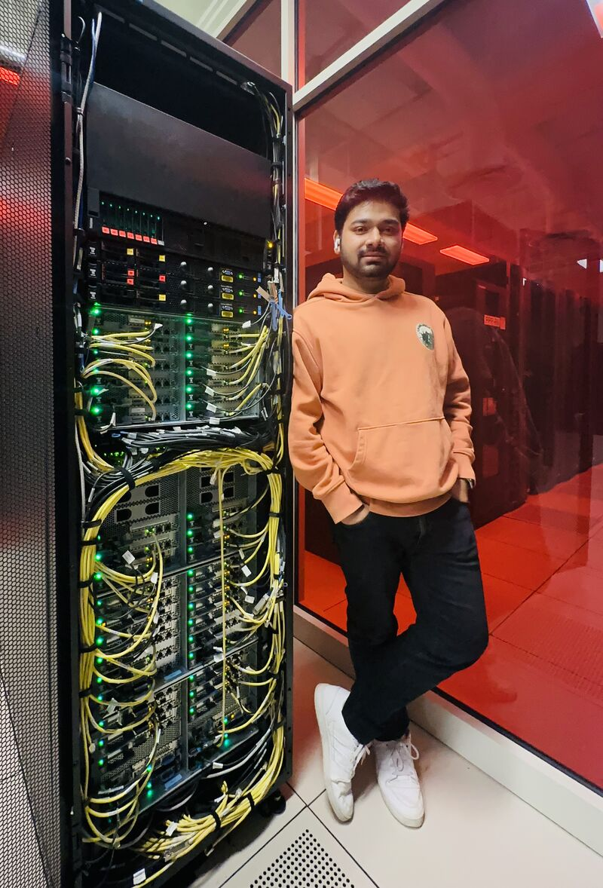
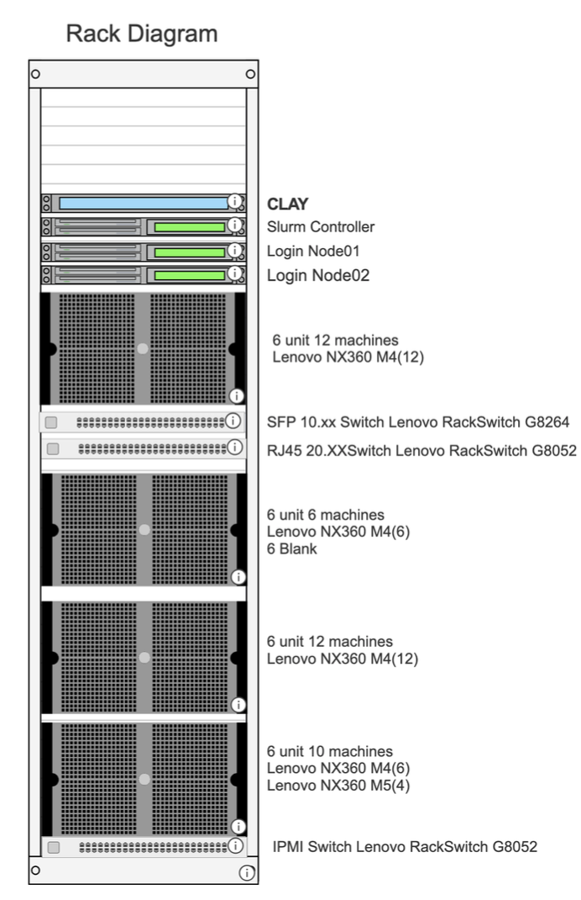
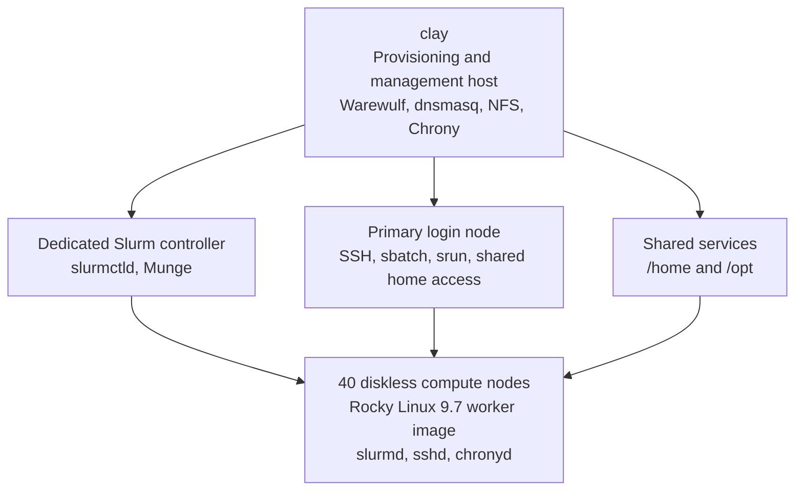
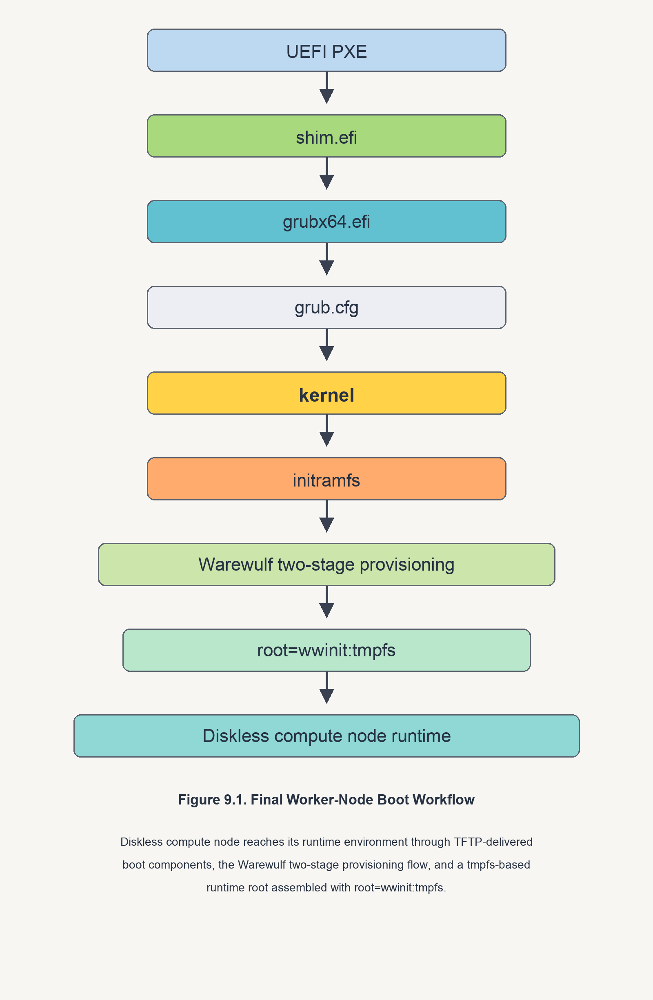
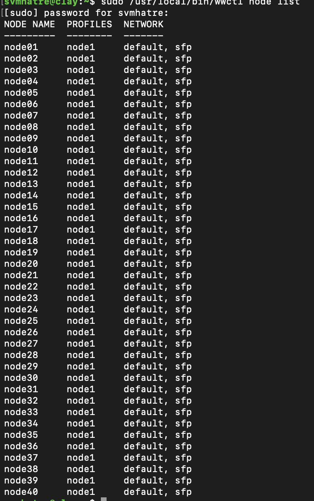
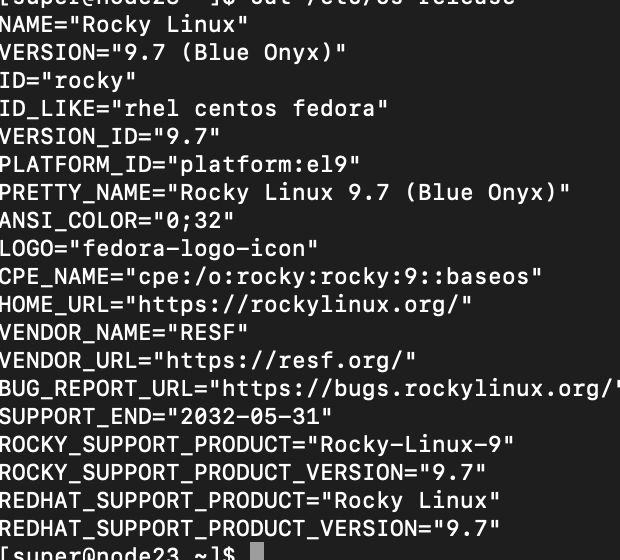

# Clay: Building a 40-Node Diskless HPC Cluster with Warewulf

This repository is a public-safe project showcase for the Clay cluster: a 40-node diskless HPC environment I built with Warewulf, Slurm, shared storage, and centralized image management on repurposed Lenovo NeXtScale hardware.

It is intentionally written as a project portfolio, not as an internal operations manual. The goal is to show what I built, why I built it this way, how I validated it, and what engineering problems I had to solve, without publishing internal addressing, credentials, MAC inventories, or other sensitive infrastructure details.

## Table of Contents

- [Project Overview](#project-overview)
- [Why I Built It](#why-i-built-it)
- [What I Actually Built](#what-i-actually-built)
- [Project Snapshot](#project-snapshot)
- [System Architecture](#system-architecture)
- [How the Cluster Boots](#how-the-cluster-boots)
- [How I Built and Validated It](#how-i-built-and-validated-it)
- [Selected Evidence](#selected-evidence)
- [Benchmark Highlights](#benchmark-highlights)
- [What This Repository Includes](#what-this-repository-includes)
- [What I Intentionally Left Out](#what-i-intentionally-left-out)
- [Acknowledgment](#acknowledgment)

## Project Overview

Over the past few months, I built a diskless HPC cluster from the ground up using Warewulf as the provisioning layer, Slurm as the scheduler, shared storage for user data and software, and a centralized image-and-overlay model for compute nodes.

The core objective was not just to get machines to PXE boot. The real goal was to create a reusable cluster model where:

- users log in through a normal shared-home workflow
- jobs run through Slurm instead of ad hoc SSH orchestration
- compute nodes stay stateless and rebuildable
- the software environment stays centralized
- node recovery is done through images and overlays, not node-by-node hand repair

This made the project useful both as a real HPC systems build and as a platform that could support lab-style teaching, benchmarking, and research workflows.



The photo above is from the actual hardware environment used for the build.

## Why I Built It

I wanted to build something closer to a real Linux HPC environment than a one-off node farm.

That meant solving a few specific problems:

- how to boot and manage a large set of diskless nodes consistently
- how to keep the cluster easy to rebuild after experiments or breakage
- how to separate provisioning, scheduling, and user access cleanly
- how to support shared user storage and shared software without turning the compute nodes into manually managed pets
- how to prove the system was usable through real workload execution, not just service status screenshots

The final cluster design reflects those priorities. It is image-driven, role-separated, and operationally focused.

## What I Actually Built

The finished environment includes:

- 40 diskless compute nodes
- a central provisioning and management host
- a dedicated Slurm controller
- a login-node-based user workflow
- shared `/home` and `/opt` storage
- separate control-plane and workload-side networking
- centralized Rocky Linux worker images
- repeatable node rebuild and recovery through Warewulf

At a software level, the project validates the interaction between:

- Warewulf `4.6.4-1`
- Rocky Linux `10.1` on the provisioning host
- Rocky Linux `9.7` on the worker image and scheduler-side systems
- `dnsmasq` for DHCP and TFTP
- Slurm for scheduling
- Munge for scheduler authentication
- Chrony for time synchronization
- HPL and MPI for multi-node benchmark validation

## Project Snapshot

The repository now shows three different views of the project:

- the physical cluster hardware
- the logical layout of the rack and cluster roles
- live screenshots from the working software stack

### Physical Rack



This diagram shows the physical arrangement of the Clay host, Slurm controller, login nodes, switches, and worker-node chassis in the rack.

## System Architecture

The cluster is organized around clear role separation.



This separation matters because it keeps responsibilities clean:

- the provisioning host manages images, overlays, boot services, and shared filesystems
- the Slurm controller manages scheduling and node state
- the login node provides the user-facing workflow
- the compute nodes stay stateless and execution-focused

More detail:

- [Architecture Notes](docs/architecture.md)
- [Implementation Notes](docs/implementation.md)

## How the Cluster Boots

The compute nodes do not boot from local operating system installs. They start through a centralized UEFI network-boot path and then enter a Warewulf-managed runtime.

The high-level boot sequence is:

1. UEFI PXE starts on the management-facing NIC.
2. DHCP and TFTP deliver the initial boot components.
3. `shim.efi` and `grubx64.efi` hand off into GRUB.
4. GRUB loads the kernel and initramfs for the worker image.
5. Warewulf continues the two-stage provisioning flow.
6. The node enters a stateless runtime using `root=wwinit:tmpfs`.



This boot model was one of the hardest parts of the project to stabilize. The final result matters because it turned the cluster into something repeatable instead of fragile.

## How I Built and Validated It

I approached the cluster as a systems-integration project rather than a package-install task.

At a practical level, the build sequence looked like this:

1. Establish a clean provisioning host and worker-image model.
2. Stabilize UEFI PXE, TFTP, GRUB, kernel, and initramfs behavior on real hardware.
3. Separate provisioning, scheduler, login, and storage roles so the cluster had clear operating boundaries.
4. Make the compute nodes stateless and image-driven instead of relying on manual node-side repair.
5. Validate shared storage, SSH, scheduler registration, and login-node-based job execution.
6. Push the system through real HPL and MPI workloads to prove that the environment worked under actual distributed execution.

Along the way I had to solve several non-trivial problems, including:

- firmware-sensitive UEFI and GRUB behavior
- worker-image and host-OS separation
- dual-NIC identity and routing decisions
- runtime overlay propagation issues
- login-node firewall behavior that affected `srun`
- Slurm registration mismatches on specific nodes
- getting the final user-facing workflow to work for non-root jobs

The important part is that the final system was validated through real use, not just by having services in an "active" state.

## Selected Evidence

This public repository includes real screenshots and sanitized excerpts that show the cluster was actually built and tested, while keeping internal details private.

### 1. Warewulf Managing the Full 40-Node Fleet



This is a direct screenshot from the live provisioning host showing Warewulf managing the worker-node fleet rather than a hand-written example.

### 2. Worker Nodes Running the Intended Rocky Linux 9.7 Environment



This screenshot shows a live worker node reporting the expected Rocky Linux 9.7 runtime environment.

### 3. Output Excerpts Preserved in the Documentation

In addition to screenshots, I kept representative command output excerpts from the working cluster so the public repo still shows concrete evidence even when the original screenshots contain private addressing that should not be published.

<details>
<summary>Fleet visibility through Warewulf</summary>

```text
$ wwctl node list
NODE NAME  PROFILES  NETWORK
node01     node1     default, sfp
node02     node1     default, sfp
node03     node1     default, sfp
...
node38     node1     default, sfp
node39     node1     default, sfp
node40     node1     default, sfp
```

</details>

<details>
<summary>Worker nodes validated on Rocky Linux 9.7</summary>

```text
$ cat /etc/os-release
NAME="Rocky Linux"
VERSION="9.7 (Blue Onyx)"
ID="rocky"
VERSION_ID="9.7"
PRETTY_NAME="Rocky Linux 9.7 (Blue Onyx)"
```

</details>

<details>
<summary>Shared storage mounted into the diskless runtime</summary>

```text
$ mount | grep -E '/opt|/home'
<storage-host>:/opt  on /opt  type nfs4 (...)
<storage-host>:/home on /home type nfs4 (...)
```

</details>

<details>
<summary>Interactive Slurm execution from the login-node workflow</summary>

```text
$ srun -N4 -n4 hostname
node03
node01
node04
node02
```

</details>

<details>
<summary>Non-root job behavior validated</summary>

```text
User info:
uid=10000(<user>) gid=10000(<user>)
Sudo check:
NO_SUDO_ACCESS
Hostnames:
node01
node03
node02
node04
```

</details>

More detail:

- [Validation Notes](docs/validation.md)

## Benchmark Highlights

Benchmarking was part of the engineering validation, not an afterthought. I used HPL to prove that the cluster could move beyond provisioning and scheduling checks into real multi-node execution.

Public-safe highlights:

- best 40-node HPL result: `11.107 TFLOPS`
- about `83.44%` of theoretical peak on that run
- successful 40-node HPL execution through the normal user-facing cluster workflow
- successful non-root HPL validation, not just admin-only benchmark runs

Example HPL result excerpt:

```text
T/V                N      NB    P    Q        Time                Gflops
WR00R2R4      353024    224   16   40      2640.77             1.1107e+04

Finished      1 tests with the following results:
              1 tests completed and passed residual checks
```

That excerpt comes from a real 40-node HPL run and is included here because it is one of the clearest pieces of evidence that the cluster moved beyond provisioning into real HPC execution.

More detail:

- [Benchmark Notes](docs/benchmarks.md)

## What This Repository Includes

- `README.md`
  - public-facing project narrative
- `assets/worker-node-boot-workflow.png`
  - public-safe boot workflow diagram
- `docs/architecture.md`
  - high-level architecture and design decisions
- `docs/implementation.md`
  - why I made the choices I made and how the system came together
- `docs/validation.md`
  - public-safe validation evidence and workflow verification
- `docs/benchmarks.md`
  - HPL benchmarking goals, results, and interpretation

## What I Intentionally Left Out

This repository does **not** publish:

- internal IP addressing plans
- MAC address inventories
- unredacted host resolution data
- authentication keys or fingerprints
- full infrastructure configuration files
- private operational playbooks
- internal usernames and access paths
- screenshots that expose sensitive network or identity details

That material exists in private documentation and working notes, but it does not belong on a public GitHub repository for an active environment.

## Acknowledgment

I’m grateful to Shawn Slavin, Winona Snapp-Childs, and the Research Partnership team at Indiana University for giving me the opportunity to work on something this impactful and for the guidance and support along the way.
