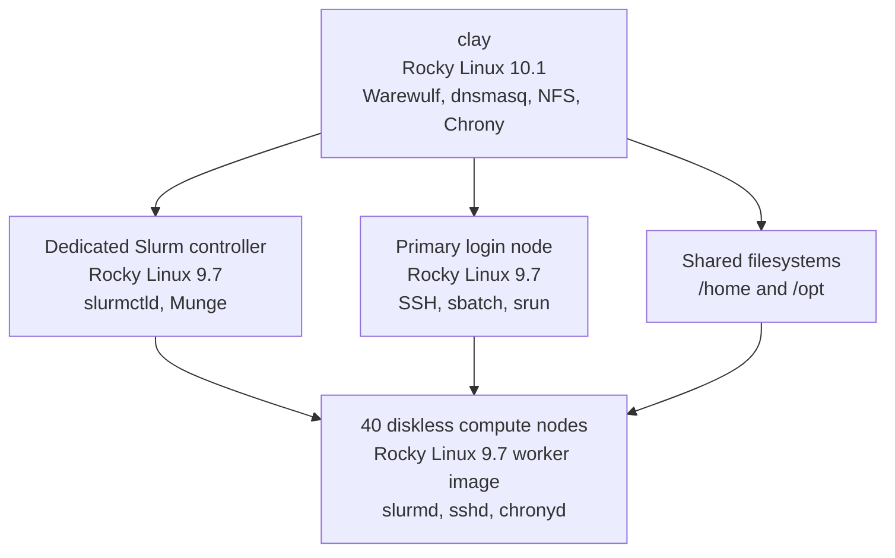

# Architecture

This page summarizes the cluster design in a public-safe form and explains why the roles were separated the way they were.

## High-Level Layout

At a high level, the cluster is divided into:

- one provisioning and management host
- one dedicated scheduler controller
- a login-node access layer
- a 40-node diskless compute fleet
- centrally exported shared filesystems

## Why the Roles Were Split

The cluster is easier to operate when the responsibilities are clear.

### Provisioning and Management Host

The provisioning host is responsible for:

- Warewulf image management
- node definitions
- boot-service support
- shared filesystems
- cluster time source

This host is where the cluster is defined and rebuilt.

### Slurm Controller

The scheduler control plane runs on a dedicated system rather than on the provisioning host. That separation reduces coupling between cluster bootstrapping and scheduler behavior.

It also aligns the scheduler-side environment with the worker-node operating system family, which helped avoid compatibility drift.

### Login Node Layer

The login-node layer is the user-facing entry point.

This is important because it keeps:

- users off the provisioning host
- interactive access separate from diskless node management
- the compute nodes focused on execution instead of general user entry

### Compute Nodes

The compute nodes are stateless and centrally managed. They are designed to boot, run workloads, and return to a known baseline on reboot.

That operating model is a major part of what makes the cluster rebuildable.

## Boot and Runtime Model

The worker nodes follow a centralized boot path:

1. UEFI PXE starts over the management-side path.
2. Early boot artifacts are delivered through TFTP.
3. GRUB loads the kernel and initramfs.
4. Warewulf completes the runtime provisioning flow.
5. The node enters a stateless runtime assembled through the worker-image model.

The important design point is that the cluster is not maintained through per-node local operating system installs. The worker image, overlays, and generated provisioning state define the runtime behavior.

## Storage Model

Persistent data is intentionally separated from the stateless node runtime.

The cluster uses shared filesystems for:

- `/home`
- `/opt`

That gives users a consistent environment while allowing the compute nodes themselves to stay disposable and image-driven.

## Networking Model

The system uses a split network design with separate roles for:

- management and control-plane traffic
- workload-side and data-path traffic

This is not just an optimization detail. In a multi-NIC cluster, provisioning, host resolution, scheduler communication, and runtime behavior all depend on the control-plane identity being consistent.

## Hardware Context

The compute fleet is built on repurposed Lenovo NeXtScale hardware, primarily NX360 M4 systems with some higher-core M5-based nodes. That mixed hardware profile made the project more realistic because it required the software design to tolerate variation instead of assuming a perfectly uniform lab environment.

## Why This Design Matters

The architecture supports the goals that mattered most for the project:

- rebuildability
- centralized administration
- controlled user access
- repeatable node behavior
- real workload execution through Slurm

That combination is what turned the cluster into a working platform instead of a one-time boot experiment.
